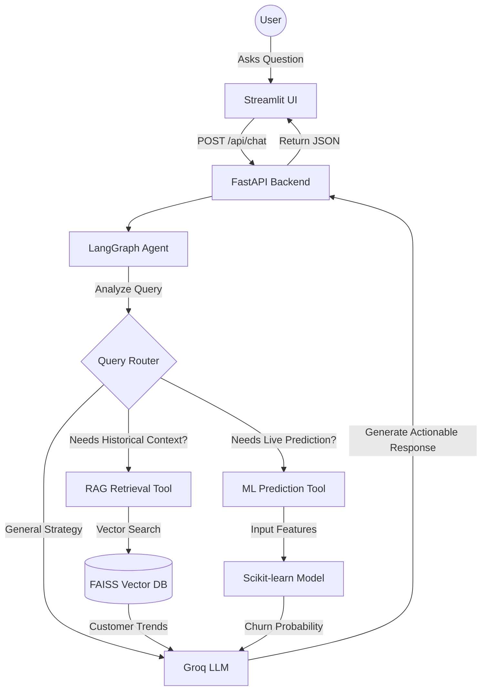

# AI Agentic Customer Churn Predictor

🚀 **Live Demo:** [https://customer-churn-yf2q.onrender.com/](https://customer-churn-yf2q.onrender.com/)

A production-grade, full-stack machine learning application that predicts the probability of credit card customer churn. It features a classical ML predictive core powered by Scikit-learn, combined with a cutting-edge **LangGraph & FAISS AI Retention Specialist Agent**.

This architecture runs on a **FastAPI** backend ("The Brain") and a **Streamlit** frontend ("The Face") styled with a premium Glassmorphism design and highly secure guardrails.

---

## 📖 Project Context & Objectives

**What we wanted to achieve:**
The primary goal of this project was to build a dual-engine application for bank administrators and retention specialists. We wanted to seamlessly blend traditional, highly interpretable Machine Learning (to predict *if* a customer will churn) with Generative AI (to understand *why* they might churn and *how* to retain them).

We set out to achieve:
1. A **highly accurate predictive engine** that doesn't just output numbers, but provides actionable insights.
2. A **conversational AI agent** capable of querying historical churn databases and triggering live ML predictions on command.
3. A **premium, modern UI** that feels intuitive and responsive.
4. A **cloud-native, scalable architecture** capable of deploying both a UI and an ML API separately without ballooning server costs.

---

## 🧗‍♂️ The Challenge

As we moved to deploy the full-stack system onto cloud platforms (specifically Render's free tier), we hit several critical roadblocks:
- **Memory Constraints:** Loading the dataset, training multiple Scikit-learn models (Logistic Regression & Decision Trees), initializing PyTorch, and building a FAISS vector database on boot exceeded the 512MB RAM limits, causing the server to crash with `500 Internal Server Errors`.
- **Boot Timeouts:** Training models and generating vector embeddings on-the-fly took over 60 seconds, which violated cloud health-check timeout rules.
- **AI Tool Calling Failures:** The initial LLMs struggled to format LangGraph tool-calling JSON correctly, leading to `400 Bad Request` API errors when the agent tried to use the prediction tool.

---

## 🏆 What We Achieved (The Solution)

We successfully overhauled the backend architecture into an **ultra-lightweight, lazy-loaded machine learning pipeline**, resolving all deployment bugs while keeping the app lightning fast. 

**Key Technical Achievements:**
1. **Lazy-Loading Architecture:** The FastAPI backend no longer loads heavy ML models or the FAISS vector database during the boot sequence. Instead, it boots instantly and only loads the required models into memory *upon the first user request*.
2. **Pre-Serialization:** We decoupled the training pipeline. Models are now pre-trained locally and saved as `.joblib` binary files. In production, the backend simply loads the pre-computed weights, saving massive amounts of RAM and CPU time.
3. **Cloud Embedding Offloading:** We stripped out local `PyTorch` dependencies entirely, shrinking the Docker/Render image size. The FAISS database now generates text embeddings via the **Hugging Face Cloud API**.
4. **Optimized LLM Routing:** Upgraded the LangGraph node to use `meta-llama/llama-4-scout-17b-16e-instruct` via Groq, which completely eliminated the `400 Tool Use Failed` errors due to superior JSON tool-calling capabilities. 
5. **Robust Frontend UX:** Implemented graceful error handling and "Warming Up" animations in Streamlit. If the backend is asleep or waking up (returning a `503 Service Unavailable`), the frontend intercepts this and displays a friendly loading state rather than crashing.

---

## 🔥 Key Features

- **Agentic AI Specialist**: Chat with a LangGraph AI agent powered by Groq that can retrieve historical database trends (FAISS) and run live ML predictions on explicit command.
- **Unbreakable Guardrails**: AI persona is strictly limited to banking and churn analysis. Unrelated queries are rejected.
- **Hybrid Database**: Local `FAISS` for semantic vector search and `NeonDB (PostgreSQL)` / `SQLite` for persistent Agent Chat History and Strategies.
- **Full-Stack Separation**: A complete decouple of the UI from the Machine Learning logic. Fast frontend iteration, stable backend execution.
- **Premium Glass UI**: A visually breathtaking "Dark Mode" aesthetic using the Outfit typeface and glassmorphism styling.

---

## 🛠️ Tech Stack

| Layer          | Technology                                           |
|----------------|------------------------------------------------------|
| **Frontend**   | Streamlit 1.32 (Requests, Custom CSS)                |
| **Backend**    | FastAPI, Uvicorn, SQLAlchemy                         |
| **ML Core**    | Scikit-learn, Pandas, NumPy, Joblib                  |
| **AI Agent**   | LangGraph, LangChain, Groq API                       |
| **Vector DB**  | FAISS, HuggingFace Inference API                     |

---

## 📂 Dataset Setup

1. Download the **BankChurners** dataset.
2. Place the file at the following path relative to the project root:

```
CHURN_PRJ/
└── data/
    └── BankChurners.csv
```

---

## 🚀 Installation & Setup

```bash
# 1. Clone or download the project
cd CHURN_PRJ

# 2. Setup Virtual Environment & Install dependencies
python3 -m venv venv
source venv/bin/activate
pip install -r requirements.txt

# 3. Pre-train ML Models (Generates .joblib files)
python backend/train_and_save.py
```

---

## 🏃‍♂️ Running the System Locally

Because this is a full-stack project, you must run both the backend server and the frontend client simultaneously in separate terminal windows.

### Terminal 1: Start the FastAPI Backend (The Brain)
```bash
# Set required Environment Variables
export GROQ_API_KEY="your-groq-api-key"
export HUGGINGFACEHUB_API_TOKEN="your-hf-token"

uvicorn backend.main:app --reload
```
The backend runs on `http://127.0.0.1:8000`. You can access the API Swagger documentation at `http://127.0.0.1:8000/docs`.

### Terminal 2: Start the Streamlit Frontend (The Face)
```bash
streamlit run app.py
```
The UI runs automatically at `http://localhost:8501`.

---

## 🌐 Cloud Deployment (Render)

This project is optimized for deployment on Render's Free Tier using **Render Blueprints**.

### 1. Database Setup (Neon)
- Create a free account at [Neon.tech](https://neon.tech).
- Create a new project and copy the **Connection String** (`postgresql://...`).

### 2. Render Deployment
- Push your code to a GitHub repository.
- In the Render Dashboard, click **New +** > **Blueprint**.
- Select your repository.
- Render will automatically detect the `render.yaml` file and deploy both backend and frontend services.

### 3. Environment Variables
Ensure the following are set in your Render services:
- `GROQ_API_KEY`: Your Groq API key (Backend).
- `HUGGINGFACEHUB_API_TOKEN`: Your HuggingFace API key (Backend).
- `DATABASE_URL`: Your Neon Postgres connection string (Backend).

---

## 🔄 AI Agent Workflow

The following diagram illustrates how the LangGraph AI Agent processes user queries, retrieves context, and triggers live predictions:



---

## 🤖 Using the AI Agent

1. Open the Streamlit App.
2. Ensure the Backend is running. The UI will display a "Warming Up" animation if the cloud server is waking up.
3. Open the sidebar and enter your **Groq API Key**.
4. Navigate to the **💬 AI Agent** tab.
5. Ask questions like:
   - *"What are the main traits of churned customers?"*
   - *"Suggest a retention strategy for older customers with high balances."*
   - *"Analyze churn risk for a male, 42 years old, 700 credit score, in France, 4 tenure, 40000 balance."*

---

## 🛡️ Architecture & Security

- **Pydantic Validation**: All frontend requests are strictly validated before entering the ML pipeline.
- **Agent Guardrails**: The LangGraph state machine enforces the `SYSTEM_PROMPT` recursively. It physically lacks tools to execute system operations or non-banking domain reasoning.
- **Data Privacy**: Vector search runs locally via FAISS. No raw tabular data is sent to external APIs (only context segments specifically requested in chat).

---

## 👥 Team Details

- **Aarush Gupta :** 2401020001
- **Utkarsh :** 2401010484
- **Deepak Mishra :** 2401010142
- **Samriddhi Shah :** 2401010411
